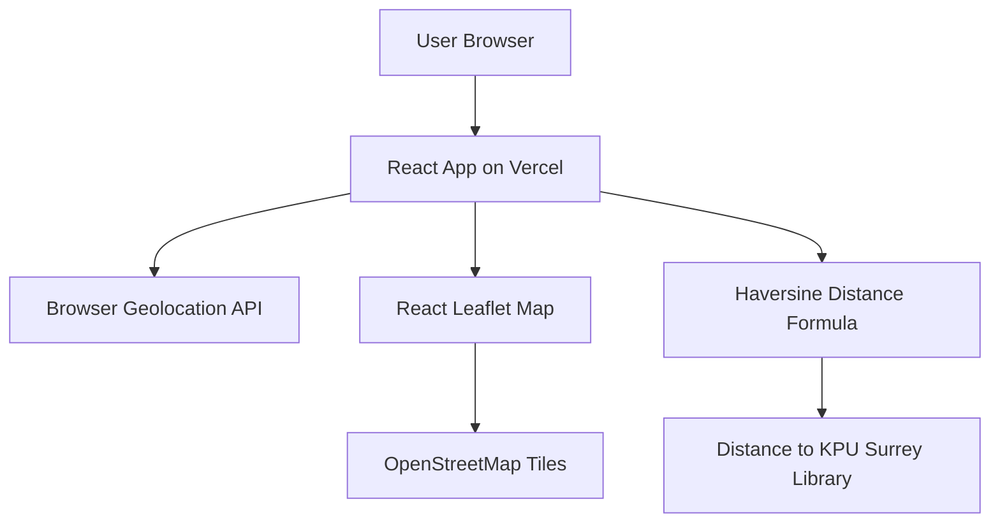

# KPU Surrey Library Distance App

This is a simple React web app for INFO 4235. It uses the browser's location feature to show the user's current location on a map and calculate the distance to the KPU Surrey Library in kilometers.

## Architecture



## Tech Stack

- React
- Vite
- React Leaflet
- Leaflet
- OpenStreetMap
- Vercel

## How To Run Locally

```bash
npm install
npm run dev
```

Then open the local URL shown in the terminal.

## Notes

- The app does not need an API key.
- Location permission must be allowed in the browser.
- Distance is calculated in kilometers using the Haversine formula.
